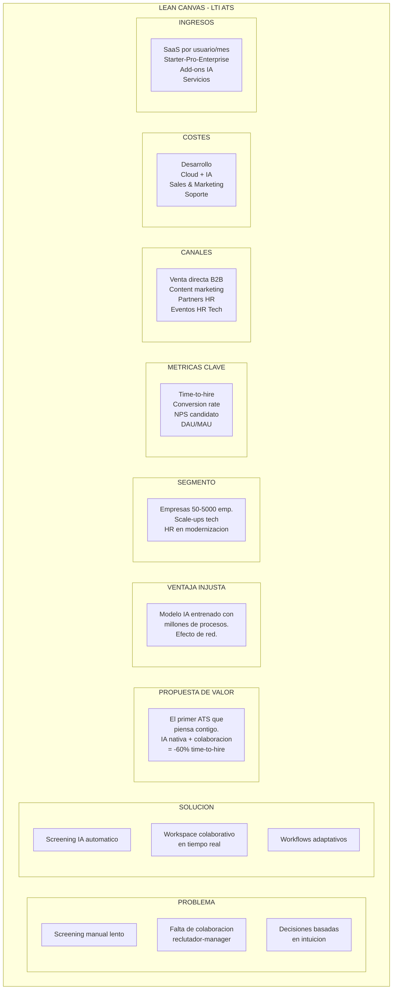
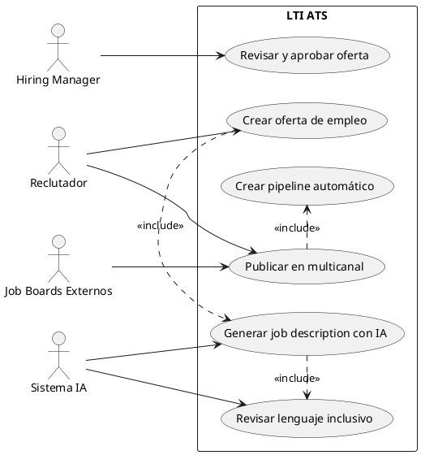
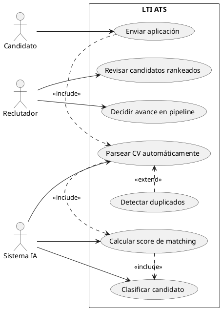
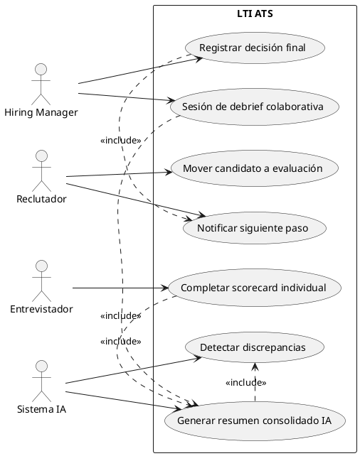
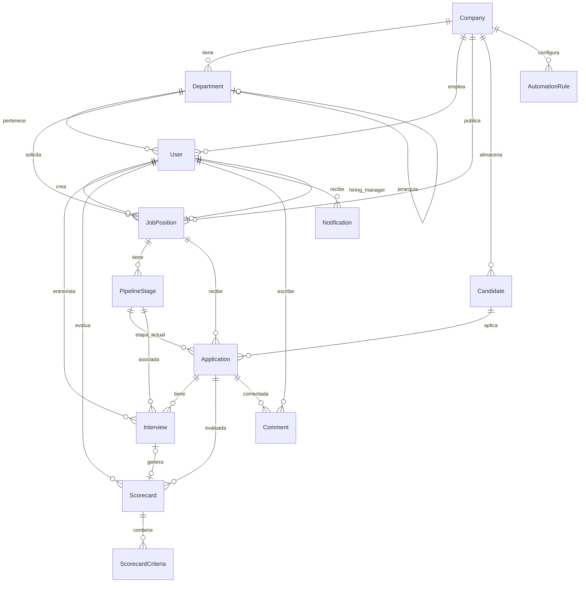
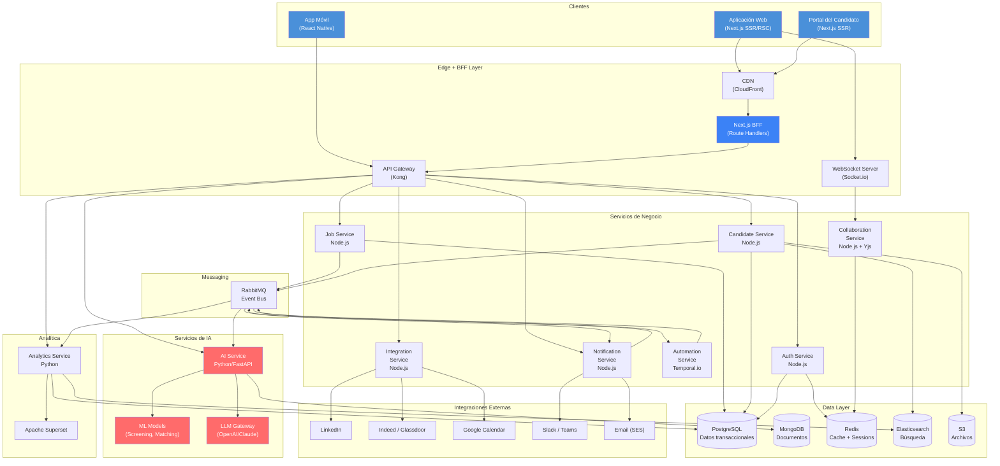
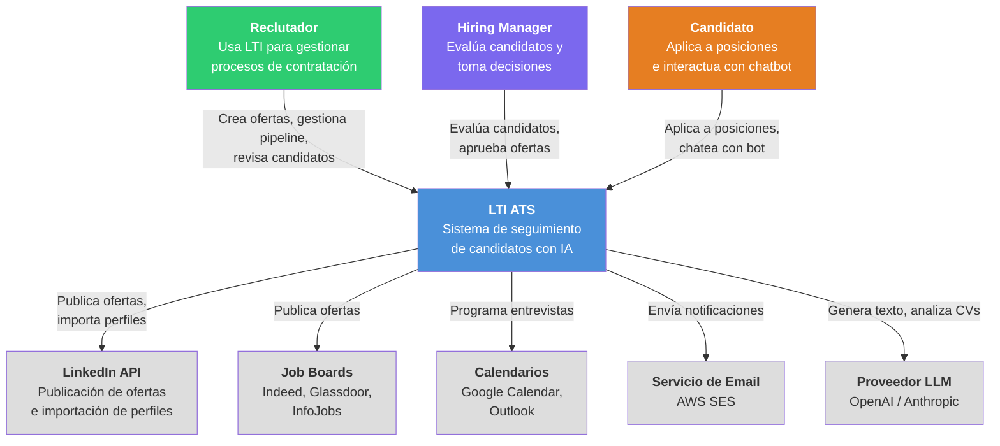
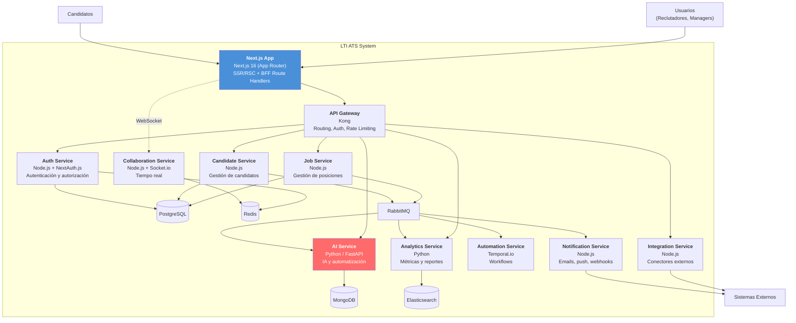
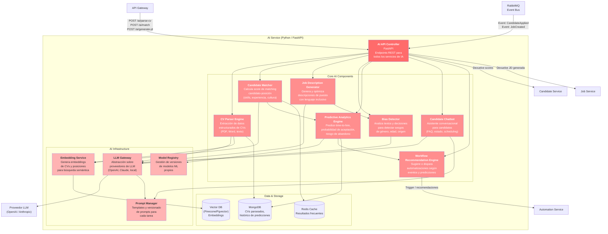

# LTI - Applicant Tracking System del Futuro

## Índice

1. [Investigación y Análisis](#1-investigacion-y-analisis)
2. [Descripción del Software LTI](#2-descripcion-del-software-lti)
3. [Funciones Principales](#3-funciones-principales)
4. [Lean Canvas](#4-lean-canvas)
5. [Casos de Uso Principales](#5-casos-de-uso-principales)
6. [Modelo de Datos](#6-modelo-de-datos)
7. [Diseño del Sistema a Alto Nivel](#7-diseno-del-sistema-a-alto-nivel)
8. [Diagrama C4](#8-diagrama-c4)

---

## 1. Investigación y Análisis

### 1.1 Contexto del problema

Los sistemas ATS tradicionales han resuelto de forma razonable la trazabilidad de candidaturas, pero siguen presentando fricciones importantes en tres áreas clave:

- **Sobrecarga operativa para HR**: gran parte del tiempo del reclutador se consume en filtrar CVs, coordinar entrevistas, perseguir feedback y mantener actualizado el pipeline.
- **Colaboración fragmentada**: recruiters, hiring managers y entrevistadores suelen trabajar entre ATS, correo, Slack y hojas de cálculo, lo que genera retrasos y pérdida de contexto.
- **Baja inteligencia del proceso**: muchos ATS almacenan datos pero ayudan poco a decidir, priorizar o automatizar tareas de alto volumen.

LTI nace para cubrir ese hueco: no solo registrar candidaturas, sino reducir trabajo manual, mejorar la calidad de decisión y acelerar el time-to-hire con IA y colaboración en tiempo real.

### 1.2 Análisis de mercado y competidores

Se ha realizado un benchmark de referencia sobre soluciones ATS ampliamente conocidas para identificar capacidades base, oportunidades de diferenciación y elementos que no merece la pena reinventar.

| Solución | Fortalezas | Limitaciones detectadas | Oportunidad para LTI |
|----------|------------|-------------------------|----------------------|
| Greenhouse | Madurez en pipeline, scorecards, integraciones | Experiencia colaborativa poco nativa, IA no central | Diferenciar con colaboración en tiempo real e IA transversal |
| Lever | CRM de talento y facilidad de uso | Automatización y analítica menos avanzadas en escenarios complejos | Añadir workflows adaptativos y predicción |
| Workday | Suite corporativa robusta, gobierno y compliance | Complejidad alta, UX pesada, menor agilidad para medianas empresas | Ofrecer time-to-value rapido y mejor UX |
| BambooHR / ATS ligeros | Simplicidad y adopcion inicial facil | Capacidad limitada para hiring colaborativo y alto volumen | Cubrir scale-ups y empresas en crecimiento |

### 1.3 Hallazgos clave

Del análisis inicial se desprenden los siguientes aprendizajes:

1. La **velocidad operativa** sigue siendo una métrica crítica: reducir revisiones manuales, tiempos de coordinación y bloqueos entre roles.
2. La **calidad del hiring** depende tanto del dato como del proceso: scorecards, feedback estructurado y visibilidad compartida.
3. La **IA aporta valor real** cuando se integra en el flujo de trabajo, no cuando se ofrece como funcionalidad aislada.
4. Muchas capacidades adyacentes como email, calendarios, autenticación o almacenamiento documental son terreno de **buy/integrate**, no de build desde cero.
5. La ventaja competitiva sostenible para LTI debe centrarse en el core: matching, automatización, colaboración y analítica predictiva.

### 1.4 Requisitos iniciales del sistema

#### Requisitos funcionales

- Crear, aprobar y publicar ofertas en múltiples canales.
- Gestionar candidatos y candidaturas a través de un pipeline configurable.
- Analizar CVs con IA y generar un score de matching explicable.
- Facilitar evaluación colaborativa con scorecards, comentarios y debrief compartido.
- Automatizar comunicaciones, cambios de etapa y tareas internas.
- Proveer dashboards operativos y métricas de negocio del proceso de hiring.

#### Requisitos no funcionales

- **Escalabilidad** para empresas desde 50 hasta 5.000 empleados.
- **Alta disponibilidad** en módulos core del proceso de selección.
- **Seguridad y cumplimiento** con foco en GDPR, trazabilidad y control de acceso.
- **Integrabilidad** con job boards, calendarios, correo, HRIS y herramientas colaborativas.
- **Observabilidad** para medir SLAs, latencia de IA, errores de integración y eventos del pipeline.

### 1.5 Decisión buy vs build

Para una primera versión del producto, LTI prioriza construir el núcleo diferencial e integrar capacidades commodity:

| Build (core diferencial) | Buy / Integrate |
|--------------------------|-----------------|
| Matching y scoring con IA | Email transaccional |
| Workspace colaborativo de hiring | Calendarios corporativos |
| Workflow automation del pipeline | SSO / Identity Provider |
| Analítica predictiva de contratación | Almacenamiento de archivos |
| Detección de sesgo y recomendación | Publicación en job boards vía APIs |

Esta aproximación reduce time-to-market y concentra esfuerzo de producto e ingeniería donde LTI puede crear una ventaja real.

---

## 2. Descripción del Software LTI

### 2.1 Qué es LTI

LTI es un **Applicant Tracking System (ATS)** de nueva generación diseñado para transformar la forma en que las empresas gestionan sus procesos de contratación. A diferencia de los ATS tradicionales que actúan como simples bases de datos de candidatos, LTI integra inteligencia artificial de forma nativa en cada etapa del funnel de reclutamiento, desde la publicación de la oferta hasta la incorporación del candidato.

La plataforma está construida sobre tres pilares fundamentales: **colaboración en tiempo real** entre todos los stakeholders del proceso de hiring, **automatización inteligente** que elimina tareas repetitivas sin perder el toque humano, y **analítica predictiva** que ayuda a tomar mejores decisiones de contratación basadas en datos.

LTI se posiciona como la solución ideal para empresas de entre 50 y 5.000 empleados que buscan escalar sus procesos de contratación sin sacrificar la calidad ni la experiencia del candidato.

### 2.2 Valor Añadido

| Aspecto | ATS Tradicionales | LTI |
|---------|-------------------|-----|
| Screening de CVs | Manual o con filtros básicos | IA que analiza competencias, cultura fit y potencial |
| Colaboración | Emails y comentarios asíncronos | Workspace colaborativo en tiempo real tipo Notion |
| Automatización | Reglas estáticas if/then | Workflows inteligentes que se adaptan al contexto |
| Analítica | Reportes históricos básicos | Predicciones de time-to-hire, probabilidad de aceptación, diversidad |
| Experiencia candidato | Portales genéricos | Experiencia personalizada con chatbot IA |

### 2.3 Ventajas Competitivas

1. **IA Nativa, no bolt-on**: La inteligencia artificial no es un complemento, sino el núcleo de la plataforma. Cada funcionalidad se ha diseñado desde cero con IA integrada.

2. **Colaboración en tiempo real**: Espacios de trabajo compartidos donde reclutadores y hiring managers pueden evaluar candidatos simultáneamente, con cursores en tiempo real, comentarios contextuales y scorecards colaborativas.

3. **Automatización adaptativa**: Los workflows no son estáticos - el sistema aprende de las decisiones del equipo y sugiere optimizaciones al proceso de contratación.

4. **Time-to-value ultrarrápido**: Setup en menos de 24 horas gracias a templates de industria, importación inteligente de datos y onboarding guiado por IA.

5. **Análisis de sesgo y diversidad**: Herramientas integradas de detección de sesgos en job descriptions, screening y evaluaciones, promoviendo procesos de contratación más equitativos.

6. **Integraciones bidireccionales**: Conectores nativos con LinkedIn, Indeed, Glassdoor, Google Calendar, Slack, Microsoft Teams y más de 50 plataformas, con sincronización en tiempo real.

7. **Experiencia del candidato premium**: Portal del candidato con chatbot IA, actualizaciones automáticas de estado, programación autónoma de entrevistas y feedback personalizado.

---

## 3. Funciones Principales

### 3.1 Gestión de Ofertas de Empleo

| Función | Descripción | Usuario Principal |
|---------|-------------|-------------------|
| Creación asistida por IA | Generación automática de job descriptions optimizadas a partir de requisitos básicos, incluyendo sugerencias de lenguaje inclusivo | Reclutador |
| Publicación multicanal | Distribución simultánea a job boards, redes sociales y página de careers con un solo clic | Reclutador |
| Templates de industria | Biblioteca de plantillas de ofertas categorizadas por sector y rol, personalizables | Reclutador |
| Gestión del ciclo de vida | Control de estados (borrador, activa, pausada, cerrada) con métricas por etapa | Hiring Manager |

### 3.2 Pipeline de Candidatos

| Función | Descripción | Usuario Principal |
|---------|-------------|-------------------|
| Screening automático con IA | Análisis de CVs y perfiles que genera un score de matching con la posición, evaluando competencias técnicas, experiencia y cultura fit | Sistema IA |
| Kanban visual del pipeline | Tablero drag-and-drop para mover candidatos entre etapas, con filtros avanzados y vistas personalizadas | Reclutador |
| Parsing inteligente de CVs | Extracción automática de datos estructurados desde CVs en cualquier formato (PDF, Word, LinkedIn) | Sistema IA |
| Deduplicación de candidatos | Detección automática de candidatos duplicados con merge inteligente de perfiles | Sistema IA |

### 3.3 Colaboración y Comunicación

| Función | Descripción | Usuario Principal |
|---------|-------------|-------------------|
| Workspace colaborativo | Espacio en tiempo real para que reclutadores y managers revisen candidatos juntos, con presencia en vivo y cursores compartidos | Reclutador / Hiring Manager |
| Scorecards estructuradas | Formularios de evaluación configurables con criterios ponderados, visibles para todo el equipo de hiring | Hiring Manager |
| Mensajería interna | Chat contextual vinculado a candidatos y posiciones, con mención a miembros del equipo | Reclutador / Hiring Manager |
| Programación de entrevistas | Integración con calendarios para proponer horarios automáticamente y enviar invitaciones | Reclutador / Candidato |

### 3.4 Automatización e IA

| Función | Descripción | Usuario Principal |
|---------|-------------|-------------------|
| Workflow builder visual | Editor no-code para diseñar flujos de automatización (emails, cambios de etapa, notificaciones, tareas) | Admin / Reclutador |
| Chatbot para candidatos | Asistente IA que responde preguntas de candidatos, recopila información adicional y programa entrevistas | Candidato |
| Recomendaciones de candidatos | Motor que sugiere candidatos de la base de datos existente para nuevas posiciones | Reclutador |
| Análisis de sentimiento | Evaluación automática del tono y engagement de las comunicaciones con candidatos | Reclutador |

### 3.5 Analítica y Reporting

| Función | Descripción | Usuario Principal |
|---------|-------------|-------------------|
| Dashboard en tiempo real | Métricas clave de reclutamiento (time-to-hire, cost-per-hire, conversion rates) actualizadas en vivo | Admin / Hiring Manager |
| Predicciones de contratación | Estimaciones basadas en datos históricos sobre tiempo hasta cubrir una posición y probabilidad de aceptación de oferta | Reclutador |
| Informes de diversidad | Métricas y visualizaciones sobre diversidad en el pipeline y detección de sesgos | Admin |
| Exportación y API de datos | Exportación en múltiples formatos y API REST para integración con herramientas de BI | Admin |

### 3.6 Administración y Configuración

| Función | Descripción | Usuario Principal |
|---------|-------------|-------------------|
| Gestión de roles y permisos | Control granular de acceso por rol, departamento y tipo de posición | Admin |
| Configuración de pipeline | Personalización de etapas, criterios de evaluación y reglas de transición por departamento | Admin |
| Cumplimiento GDPR | Gestión automática de consentimientos, retenciones de datos y derecho al olvido | Admin |
| Single Sign-On (SSO) | Integración con proveedores de identidad corporativos (Okta, Azure AD, Google Workspace) | Admin |

---

## 4. Lean Canvas

```text
+---------------------+---------------------+---------------------+
|   PROBLEMA          |   SOLUCION          |  PROPUESTA DE VALOR |
|                     |                     |       UNICA         |
| 1. Procesos de      | 1. Screening auto-  |                     |
|    screening manual  |    matico con IA    | "El primer ATS que  |
|    lentos e          |    que reduce 80%   |  piensa contigo,    |
|    ineficientes      |    el tiempo de     |  no solo almacena   |
|                     |    revision         |  datos"             |
| 2. Falta de         |                     |                     |
|    colaboracion     | 2. Workspace cola-  | IA nativa +         |
|    fluida entre     |    borativo en      | colaboracion en     |
|    reclutadores y   |    tiempo real      | tiempo real para    |
|    hiring managers  |                     | reducir el time-to- |
|                     | 3. Workflows adap-  | hire un 60%         |
| 3. Decisiones de    |    tativos que      |                     |
|    contratación     |    aprenden del     |                     |
|    basadas en       |    equipo           |                     |
|    intuicion, no    |                     |                     |
|    en datos         |                     |                     |
+---------------------+---------------------+---------------------+
|  METRICAS CLAVE     |                     |  VENTAJA INJUSTA    |
|                     |                     |                     |
| - Time-to-hire      |                     | - Modelo de IA      |
| - Tasa de           |                     |   entrenado con     |
|   conversion por    |                     |   millones de       |
|   etapa             |                     |   procesos de       |
| - NPS de candidatos |                     |   contratación      |
| - Coste por         |                     | - Efecto de red:    |
|   contratación      |                     |   cuanto más se     |
| - Adoption rate     |                     |   usa, mejor        |
|   (DAU/MAU)         |                     |   predice           |
+---------------------+---------------------+---------------------+
| CANALES             |  ESTRUCTURA         |  FLUJO DE INGRESOS  |
|                     |  DE COSTES          |                     |
| - Venta directa B2B |                     | - SaaS por usuario  |
|   (SDR + AE)        | - Equipo de         |   /mes              |
| - Content marketing  |   desarrollo        |   (3 tiers:         |
|   y SEO             | - Infraestructura   |   Starter $49,      |
| - Partnerships con  |   cloud (AWS/GCP)   |   Pro $99,          |
|   consultoras HR    | - Costes de IA      |   Enterprise        |
| - Marketplaces de   |   (modelos LLM,     |   custom)           |
|   integraciones     |   GPU)              | - Add-ons de IA     |
| - Programa de       | - Sales & Marketing |   avanzada          |
|   referidos         | - Soporte al cliente| - Servicios de      |
| - Eventos HR Tech   |                     |   implementacion    |
+---------------------+---------------------+---------------------+
|  SEGMENTO DE CLIENTES                                           |
|                                                                  |
| - Empresas medianas (50-500 empleados) en crecimiento           |
| - Scale-ups tecnológicas con alto volumen de contratación        |
| - Departamentos de HR que buscan modernizar su stack             |
| - Empresas comprometidas con diversidad e inclusion              |
+------------------------------------------------------------------+
```

### Lean Canvas - Diagrama Mermaid



---

## 5. Casos de Uso Principales

### 5.1 Caso de Uso 1: Publicación y Gestión de una Oferta de Empleo

**Actores:**
- **Primario:** Reclutador
- **Secundarios:** Hiring Manager, Sistema de IA, Job Boards externos

**Descripción:** El reclutador crea una nueva oferta de empleo con asistencia de IA, la revisa con el hiring manager, y la publica simultáneamente en múltiples canales.

**Precondiciones:**
- El reclutador está autenticado en el sistema
- Existe al menos un departamento configurado
- El hiring manager esta registrado en el sistema

**Postcondiciones:**
- La oferta está publicada y visible en los canales seleccionados
- El pipeline asociado está creado con las etapas configuradas
- El hiring manager ha sido notificado

**Flujo Principal:**

1. El reclutador selecciona "Crear nueva posición"
2. Introduce los requisitos básicos (título, departamento, nivel, habilidades clave)
3. El sistema de IA genera automáticamente una job description completa y optimizada
4. El sistema sugiere mejoras de lenguaje inclusivo si detecta sesgos
5. El reclutador revisa y edita la descripción generada
6. El reclutador invita al hiring manager a revisar la oferta
7. El hiring manager recibe notificación y revisa en el workspace colaborativo
8. El hiring manager aprueba o sugiere cambios (en tiempo real)
9. El reclutador selecciona los canales de publicación (job boards, careers page, LinkedIn)
10. El sistema publica automáticamente en todos los canales seleccionados
11. Se crea el pipeline con las etapas predefinidas para ese tipo de posición
12. Ambos actores reciben confirmación de la publicación

**Flujo Alternativo - Rechazo del Hiring Manager:**

- En el paso 8, si el hiring manager sugiere cambios:
  - El sistema notifica al reclutador con los comentarios
  - El reclutador modifica la oferta
  - Se vuelve al paso 6

**Diagrama de Caso de Uso (PlantUML):**



---

### 5.2 Caso de Uso 2: Screening y Evaluación de Candidatos con IA

**Actores:**
- **Primario:** Reclutador
- **Secundarios:** Sistema de IA, Candidato

**Descripción:** Cuando un candidato aplica a una posición, el sistema de IA analiza automáticamente su CV, genera un score de matching y enriquece su perfil. El reclutador revisa los resultados y decide el avance en el pipeline.

**Precondiciones:**
- Existe una posición activa con pipeline configurado
- El candidato ha enviado su aplicación (CV + datos)
- El modelo de IA está operativo

**Postcondiciones:**
- El candidato tiene un perfil enriquecido con datos estructurados
- Se ha generado un score de matching con la posición
- El candidato ha sido ubicado en la etapa correspondiente del pipeline

**Flujo Principal:**

1. El candidato envía su aplicación a través del portal o un job board
2. El sistema recibe la aplicación y extrae datos del CV (parsing)
3. La IA estructura la información: experiencia, habilidades, educación, idiomas
4. La IA calcula un score de matching (0-100) basado en:
   - Coincidencia de habilidades técnicas (40%)
   - Experiencia relevante (30%)
   - Formación académica (15%)
   - Cultura fit estimado (15%)
5. El sistema clasifica al candidato automáticamente:
   - Score >= 75: "Altamente recomendado" (avanza a revisión)
   - Score 50-74: "Recomendado con reservas" (revisión manual)
   - Score < 50: "No recomendado" (notificación de rechazo automática configurable)
6. El reclutador accede al dashboard con candidatos ordenados por score
7. El reclutador revisa el perfil enriquecido y el desglose del score
8. El reclutador decide: avanzar al candidato, rechazar o solicitar más información
9. El sistema ejecuta la acción y actualiza el pipeline

**Flujo Alternativo - Candidato duplicado:**

- En el paso 2, si el sistema detecta un candidato duplicado:
  - Muestra el perfil existente al reclutador
  - Ofrece opciones: merge de perfiles, mantener separados, o descartar
  - Se continua con el perfil resultante

**Diagrama de Caso de Uso (PlantUML):**



---

### 5.3 Caso de Uso 3: Evaluación Colaborativa de Candidatos

**Actores:**
- **Primario:** Hiring Manager
- **Secundarios:** Reclutador, Entrevistadores, Sistema de IA

**Descripción:** Tras las entrevistas, el equipo de hiring evalúa colaborativamente a los candidatos finalistas usando scorecards estructuradas en el workspace compartido, tomando una decisión conjunta.

**Precondiciones:**
- El candidato ha completado al menos una entrevista
- Existe una scorecard configurada para la posición
- Al menos 2 miembros del equipo de hiring están asignados

**Postcondiciones:**
- Todos los evaluadores han completado sus scorecards
- Se ha tomado una decisión sobre el candidato (avanzar, rechazar, hold)
- La decisión y justificación quedan registradas en el sistema

**Flujo Principal:**

1. El reclutador mueve al candidato a la etapa de "Evaluación" en el pipeline
2. El sistema notifica a todos los miembros del equipo de hiring
3. Cada entrevistador accede al workspace colaborativo del candidato
4. Los entrevistadores completan su scorecard individual:
   - Puntúan cada criterio definido (1-5)
   - Añaden comentarios cualitativos por criterio
   - Emiten una recomendación global (fuerte sí / sí / neutral / no / fuerte no)
5. La IA genera un resumen consolidado de todas las evaluaciones
6. La IA detecta y señala discrepancias significativas entre evaluadores
7. El hiring manager convoca una sesión de debrief en el workspace
8. El equipo discute en tiempo real viendo las scorecards lado a lado
9. El hiring manager registra la decisión final con justificación
10. El sistema ejecuta la acción correspondiente (avanzar a oferta, rechazar, etc.)
11. El reclutador recibe notificación para continuar el proceso

**Flujo Alternativo - Empate o desacuerdo:**

- En el paso 8, si hay desacuerdo significativo:
  - La IA sugiere realizar una entrevista adicional focalizada en los puntos de discrepancia
  - El hiring manager puede aceptar la sugerencia o tomar una decisión
  - Si acepta, se programa la entrevista adicional y se vuelve al paso 2

**Diagrama de Caso de Uso (PlantUML):**



---

## 6. Modelo de Datos

### 6.1 Entidades y Atributos

#### Company (Empresa)
| Atributo | Tipo | Descripción |
|----------|------|-------------|
| id | UUID | PK - Identificador único |
| name | VARCHAR(255) | Nombre de la empresa |
| domain | VARCHAR(255) | Dominio web |
| industry | VARCHAR(100) | Sector |
| size_range | ENUM | Rango de empleados |
| plan | ENUM | Plan de suscripción (starter/pro/enterprise) |
| created_at | TIMESTAMP | Fecha de creación |
| updated_at | TIMESTAMP | Fecha de actualización |

#### Department (Departamento)
| Atributo | Tipo | Descripción |
|----------|------|-------------|
| id | UUID | PK |
| company_id | UUID | FK -> Company |
| name | VARCHAR(255) | Nombre del departamento |
| parent_department_id | UUID | FK -> Department (jerarquía) |
| created_at | TIMESTAMP | Fecha de creación |

#### User (Usuario)
| Atributo | Tipo | Descripción |
|----------|------|-------------|
| id | UUID | PK |
| company_id | UUID | FK -> Company |
| department_id | UUID | FK -> Department |
| email | VARCHAR(255) | Email (único por company) |
| full_name | VARCHAR(255) | Nombre completo |
| role | ENUM | Rol (admin/recruiter/hiring_manager/interviewer) |
| avatar_url | VARCHAR(500) | URL del avatar |
| is_active | BOOLEAN | Estado activo |
| last_login_at | TIMESTAMP | Último login |
| created_at | TIMESTAMP | Fecha de creación |

#### JobPosition (Posición / Oferta)
| Atributo | Tipo | Descripción |
|----------|------|-------------|
| id | UUID | PK |
| company_id | UUID | FK -> Company |
| department_id | UUID | FK -> Department |
| created_by | UUID | FK -> User (reclutador) |
| hiring_manager_id | UUID | FK -> User |
| title | VARCHAR(255) | Título del puesto |
| description | TEXT | Descripción completa |
| requirements | TEXT | Requisitos |
| location | VARCHAR(255) | Ubicación |
| work_mode | ENUM | Modalidad (remote/hybrid/onsite) |
| employment_type | ENUM | Tipo (full_time/part_time/contract/internship) |
| salary_min | DECIMAL(10,2) | Salario mínimo |
| salary_max | DECIMAL(10,2) | Salario máximo |
| salary_currency | VARCHAR(3) | Moneda |
| status | ENUM | Estado (draft/active/paused/closed) |
| published_at | TIMESTAMP | Fecha de publicación |
| closed_at | TIMESTAMP | Fecha de cierre |
| created_at | TIMESTAMP | Fecha de creación |
| updated_at | TIMESTAMP | Fecha de actualización |

#### PipelineStage (Etapa del Pipeline)
| Atributo | Tipo | Descripción |
|----------|------|-------------|
| id | UUID | PK |
| job_position_id | UUID | FK -> JobPosition |
| name | VARCHAR(100) | Nombre de la etapa |
| order_index | INT | Posición en el pipeline |
| stage_type | ENUM | Tipo (applied/screening/interview/evaluation/offer/hired/rejected) |
| is_automated | BOOLEAN | Tiene automatizaciones |
| created_at | TIMESTAMP | Fecha de creación |

#### Candidate (Candidato)
| Atributo | Tipo | Descripción |
|----------|------|-------------|
| id | UUID | PK |
| company_id | UUID | FK -> Company |
| email | VARCHAR(255) | Email del candidato |
| full_name | VARCHAR(255) | Nombre completo |
| phone | VARCHAR(50) | Teléfono |
| linkedin_url | VARCHAR(500) | Perfil de LinkedIn |
| location | VARCHAR(255) | Ubicación |
| resume_url | VARCHAR(500) | URL del CV almacenado |
| resume_parsed_data | JSONB | Datos estructurados del CV (parseados por IA) |
| source | VARCHAR(100) | Fuente (linkedin/indeed/referral/direct) |
| tags | VARCHAR[] | Etiquetas |
| created_at | TIMESTAMP | Fecha de creación |
| updated_at | TIMESTAMP | Fecha de actualización |

#### Application (Candidatura)
| Atributo | Tipo | Descripción |
|----------|------|-------------|
| id | UUID | PK |
| candidate_id | UUID | FK -> Candidate |
| job_position_id | UUID | FK -> JobPosition |
| current_stage_id | UUID | FK -> PipelineStage |
| ai_matching_score | DECIMAL(5,2) | Score de matching IA (0-100) |
| ai_score_breakdown | JSONB | Desglose del score por categoría |
| status | ENUM | Estado (active/hired/rejected/withdrawn) |
| rejection_reason | TEXT | Motivo de rechazo |
| applied_at | TIMESTAMP | Fecha de aplicación |
| updated_at | TIMESTAMP | Fecha de actualización |

#### Interview (Entrevista)
| Atributo | Tipo | Descripción |
|----------|------|-------------|
| id | UUID | PK |
| application_id | UUID | FK -> Application |
| interviewer_id | UUID | FK -> User |
| stage_id | UUID | FK -> PipelineStage |
| interview_type | ENUM | Tipo (phone_screen/technical/behavioral/culture_fit/final) |
| scheduled_at | TIMESTAMP | Fecha programada |
| duration_minutes | INT | Duración en minutos |
| location | VARCHAR(255) | Lugar o enlace de videollamada |
| status | ENUM | Estado (scheduled/completed/cancelled/no_show) |
| notes | TEXT | Notas de la entrevista |
| created_at | TIMESTAMP | Fecha de creación |

#### Scorecard (Evaluación)
| Atributo | Tipo | Descripción |
|----------|------|-------------|
| id | UUID | PK |
| application_id | UUID | FK -> Application |
| evaluator_id | UUID | FK -> User |
| interview_id | UUID | FK -> Interview (opcional) |
| overall_rating | INT | Valoración global (1-5) |
| recommendation | ENUM | Recomendación (strong_yes/yes/neutral/no/strong_no) |
| summary | TEXT | Resumen de la evaluación |
| submitted_at | TIMESTAMP | Fecha de envío |
| created_at | TIMESTAMP | Fecha de creación |

#### ScorecardCriteria (Criterios de la Evaluación)
| Atributo | Tipo | Descripción |
|----------|------|-------------|
| id | UUID | PK |
| scorecard_id | UUID | FK -> Scorecard |
| criteria_name | VARCHAR(255) | Nombre del criterio |
| rating | INT | Puntuación (1-5) |
| comment | TEXT | Comentario del criterio |

#### Comment (Comentario/Nota)
| Atributo | Tipo | Descripción |
|----------|------|-------------|
| id | UUID | PK |
| application_id | UUID | FK -> Application |
| author_id | UUID | FK -> User |
| content | TEXT | Contenido del comentario |
| is_private | BOOLEAN | Solo visible para el autor |
| created_at | TIMESTAMP | Fecha de creación |
| updated_at | TIMESTAMP | Fecha de actualización |

#### Notification (Notificación)
| Atributo | Tipo | Descripción |
|----------|------|-------------|
| id | UUID | PK |
| user_id | UUID | FK -> User |
| type | VARCHAR(50) | Tipo de notificación |
| title | VARCHAR(255) | Título |
| message | TEXT | Mensaje |
| reference_type | VARCHAR(50) | Tipo de entidad referenciada |
| reference_id | UUID | ID de la entidad referenciada |
| is_read | BOOLEAN | Leída |
| created_at | TIMESTAMP | Fecha de creación |

#### AutomationRule (Regla de Automatización)
| Atributo | Tipo | Descripción |
|----------|------|-------------|
| id | UUID | PK |
| company_id | UUID | FK -> Company |
| name | VARCHAR(255) | Nombre de la regla |
| trigger_event | VARCHAR(100) | Evento disparador |
| conditions | JSONB | Condiciones |
| actions | JSONB | Acciones a ejecutar |
| is_active | BOOLEAN | Activa |
| created_by | UUID | FK -> User |
| created_at | TIMESTAMP | Fecha de creación |

### 6.2 Diagrama Entidad-Relación



---

## 7. Diseño del Sistema a Alto Nivel

### 7.1 Arquitectura

LTI utiliza una **arquitectura de microservicios** organizada en dominios de negocio, comunicados a través de un API Gateway y un sistema de eventos asíncrono. Esta arquitectura se elige por:

- **Escalabilidad independiente**: El servicio de IA puede escalar horizontalmente bajo carga de screening sin afectar al resto
- **Despliegue independiente**: Cada equipo puede desplegar su servicio sin coordinación con otros
- **Resiliencia**: Un fallo en el servicio de notificaciones no afecta al pipeline core
- **Evolución tecnológica**: El servicio de IA puede usar Python/FastAPI mientras el core usa Node.js
- **Next.js como BFF**: El frontend Next.js actúa también como Backend-for-Frontend, con Route Handlers que orquestan llamadas a los microservicios, proporcionando SSR para SEO (portal del candidato) y React Server Components para rendimiento óptimo

### 7.2 Componentes Principales

| Componente | Responsabilidad | Tecnología |
|------------|----------------|------------|
| **Frontend + BFF (Next.js)** | Interfaz de usuario con SSR/RSC, workspace colaborativo en tiempo real, y capa BFF via Route Handlers que orquesta llamadas a microservicios | Next.js 16 (App Router), TypeScript, TailwindCSS, Yjs (CRDT) |
| **API Gateway** | Enrutamiento a microservicios backend, rate limiting, cache | Kong / AWS API Gateway |
| **Auth Service** | Autenticación, autorización, SSO, gestión de sesiones | Node.js, NextAuth.js, JWT |
| **Job Service** | Gestión de posiciones, publicación multicanal, pipeline | Node.js, Express |
| **Candidate Service** | Gestión de candidatos, aplicaciones, deduplicación | Node.js, Express |
| **Collaboration Service** | Workspace en tiempo real, presencia, scorecards | Node.js, Socket.io, Yjs |
| **AI Service** | Screening, matching, generación de texto, predicciones | Python, FastAPI, LangChain |
| **Notification Service** | Emails, push, in-app, webhooks | Node.js, Bull queues |
| **Automation Service** | Motor de reglas, workflows, triggers | Node.js, Temporal.io |
| **Analytics Service** | Métricas, dashboards, reportes, predicciones | Python, Apache Superset |
| **Integration Service** | Conectores con job boards, calendarios, HRIS | Node.js, Express |

### 7.3 Bases de Datos

| Base de Datos | Uso | Tecnología |
|---------------|-----|------------|
| **DB Principal** | Datos transaccionales (usuarios, jobs, candidatos, aplicaciones) | PostgreSQL |
| **DB Documentos** | CVs parseados, perfiles enriquecidos, configuraciones complejas | MongoDB |
| **Cache** | Sesiones, datos frecuentes, rate limiting | Redis |
| **Búsqueda** | Búsqueda full-text de candidatos y posiciones | Elasticsearch |
| **Cola de mensajes** | Comunicación asíncrona entre servicios | RabbitMQ / Amazon SQS |
| **Almacenamiento** | CVs, archivos adjuntos, avatares | AWS S3 |

### 7.4 Patrones de Diseño

- **API Gateway Pattern**: Punto de entrada único para todos los clientes
- **Event-Driven Architecture**: Comunicación asíncrona entre servicios vía eventos (ej: "CandidateApplied" -> triggers en AI Service y Notification Service)
- **CQRS**: Separación de lectura/escritura en Analytics Service para dashboards de alto rendimiento
- **Circuit Breaker**: Protección contra fallos en cascada entre servicios
- **Saga Pattern**: Coordinación de transacciones distribuidas (ej: proceso de contratación end-to-end)

### 7.5 Diagrama de Arquitectura de Alto Nivel



---

## 8. Diagrama C4

Profundizamos en el **AI Service**, incorporando de forma explícita su relación con el motor de automatización para mantener consistencia con la propuesta funcional del sistema.

### 8.1 Nivel 1 - Contexto del Sistema



### 8.2 Nivel 2 - Contenedores



### 8.3 Nivel 3 - Componentes del AI Service

Este es el desglose interno del **AI Service**, mostrando también su integración con el **Automation Service** cuando las capacidades inteligentes disparan workflows operativos.



### 8.3.1 Descripción de los Componentes del AI Service

| Componente | Responsabilidad | Interfaces |
|------------|----------------|------------|
| **AI API Controller** | Punto de entrada REST y consumidor de eventos. Orquesta las llamadas a los componentes internos | REST API, RabbitMQ consumer |
| **CV Parser Engine** | Extrae datos estructurados de CVs en cualquier formato. Utiliza OCR + LLM para interpretar contenido | Input: archivo CV; Output: JSON estructurado |
| **Candidate Matcher** | Calcula score de compatibilidad entre candidato y posición usando embeddings semánticos y reglas de negocio | Input: candidato + posición; Output: score 0-100 + desglose |
| **Job Description Generator** | Genera descripciones de puesto optimizadas a partir de requisitos básicos, incluyendo revisión de sesgo | Input: requisitos; Output: JD completa |
| **Bias Detector** | Analiza textos (JDs, evaluaciones) y patrones de decisión para identificar sesgos inconscientes | Input: texto/datos; Output: alertas + sugerencias |
| **Predictive Analytics Engine** | Modelos ML propios que predicen métricas de contratación basados en datos históricos | Input: posición + pipeline; Output: predicciones |
| **Candidate Chatbot** | Asistente conversacional para candidatos que responde FAQs, informa del estado y agenda entrevistas | Input: mensaje; Output: respuesta + acciones |
| **Workflow Recommendation Engine** | Traduce hallazgos de IA y eventos del pipeline en recomendaciones o triggers hacia el motor de automatización | Input: eventos + predicciones; Output: acciones sugeridas o disparadas |
| **LLM Gateway** | Capa de abstracción sobre proveedores de LLM con fallback, retry, caching y monitoring de costes | Soporta OpenAI, Anthropic, modelos locales |
| **Embedding Service** | Genera y gestiona embeddings vectoriales de CVs y posiciones para búsqueda semántica | Almacena en Vector DB (Pinecone/pgvector) |
| **Model Registry** | Gestiona versiones de modelos ML propios, A/B testing y rollback | MLflow compatible |
| **Prompt Manager** | Almacena, versiona y optimiza los prompts utilizados por cada componente de IA | Templates Jinja2 + versionado |

---

## Apéndice: Tecnologías y Herramientas

| Capa | Tecnología |
|------|------------|
| Frontend + BFF | Next.js 16 (App Router, RSC, SSR), TypeScript, TailwindCSS, Yjs (CRDT) |
| Backend (microservicios) | Node.js 20+, Express/Fastify, TypeScript |
| AI/ML | Python 3.11+, FastAPI, LangChain, scikit-learn, Hugging Face |
| Bases de datos | PostgreSQL 16, MongoDB 7, Redis 7, Elasticsearch 8 |
| Mensajería | RabbitMQ 3.13 |
| Infraestructura | AWS (ECS/EKS, RDS, S3, SES, CloudFront), Terraform |
| CI/CD | GitHub Actions, Docker, ArgoCD |
| Observabilidad | Datadog / Grafana + Prometheus, Sentry |
| Auth | Auth0 / Keycloak, JWT, OAuth 2.0, SAML |

---

*Documento generado con asistencia de Claude (Anthropic) como parte del ejercicio de diseno de sistemas AI4Devs.*
